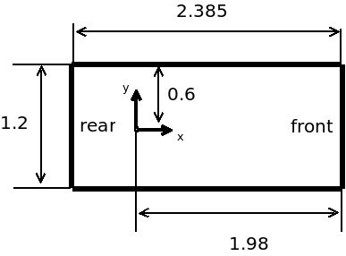

# Autonomous driving for highway crossing

## How to run the highway task

1. roslaunch autocar dataXX.launch (e.g., data1.launch)

where dataXX is the name of the data set we gave to you.

2. Put the pygame window on the top of your screen

3. Press 's' key to start the highway simulation task. 

(The autonomous car does not move by default, and your job is to write a motion planner to control the autonomous car)

4. If you see an error once you press 's' key, please make sure your
numpy version is >= 1.13.1

## Subscribed topic (autonomous car)

The autonomous car is subscribing the topic below:

1. topic name: /robot_0/control_command

2. msg type (controlCommand): 

    float32 acc

    float32 yaw

3. The controls computed by your motion planner should be sent to the topic above. 
Note that in the highway task, you are only controling the acceleration, the yaw should always be zero.

## Published topics

The following is a list of topics that the simulator is publishing:

1. /robot_i/base_pose_ground_truth (i = 1, 2, 3, ... , K)

where i indicates the ith agent car on road.

2. msg type (nav_msgs/Odometry):

http://docs.ros.org/api/nav_msgs/html/msg/Odometry.html

3. Your motion planner should subscribe to the topic above to get the current state of the ith agent car.

## Goal region

The autonomous car is considered to have crossed the road if its y-coordiate is larger than 27 

## Parameters

1. Car length: 2.385, car width: 1.2

2. Car local axis origin: see the figure below:

3. Map size: (X * Y) = (200m * 40m)

4. Map origin (0, 0) is at the left-bottom corner

5. Lane width: 3m

6. Max forward speed of autonomous car: 5 m/s

7. Max backward speed of autonomous car: -5 m/s

8. Initial autonomous car position: (100, 5, 90)

where (x, y, yaw) is the position and orientation.

## Acceleration model

The acceleration model describes how the autonomous car's velocity changes in the
simulation.

1. Ideally the acceleration model should be continuous in time. However,
this is impossible in simulation, which is discrete in time.

The ros stage simulator runs at 10 hz, which means the velocity gets
updated at every 0.1s.

3. The acceleration model of the autonomous car in simulation: 

v_t+1 = v_t + a_(t+1) * DT (velocity update)

y_t+1 = y_t + v_(t+1) * DT (position update)

where v_t, v_(t+1) is the velocity of the autonomous car at time step t and t+1. 
a_(t+1) is the acceleration at time step t+1. 
y_t, y_(t+1) is the y coordinate of the autonomous car at time t and t+1.
The constant DT = 1 / 10 is due the fact that simulation
runs at 10 hz. Note that v_t is bounded within [-5,5], i.e.,
-5 <= v_t <= 5. And this velocity bound only applies to the autonomous car.

4. The acceleration you can apply to the autonomous car is a real number
between [-10, 10].

For simplicity, 
please keep your control duration at each step to be 0.1s (10hz) as well.

## Input file: future positions of the agent cars

1. Locations of input file: future_positions/dataXX_poses.json 

2. Description of input file: the input file provides you the future positions of other agent
cars. For example, you can load the file and querying the position of 'robot_i'
at time step t_i.
You will need this information to plan controls for the autonomous car.
We assume that the simulation starts at t_0 = 0.

3. File format of dataXX_poses.json:

{'robot_1': [[x_0, y_0, ori_0 t_0], 
              [x_1, y_1, ori_1, t_1],
              ... 
              [x_N, y_N, ori_N, t_N]]

 .
 .
 .

 'robot_K': [[x_0, y_0, ori_0, t_0], 
              [x_1, y_1, ori_1, t_1],
              ... 
              [x_N, y_N, ori_N, t_N]]
}

where K is the number of agent cars on road. N is the length of the recorded data sequence.
x_i, y_i, ori_i (i = 0, 1, ... , N) are the x-coordinate, y-coordiate and orientation at 
the ith time step.
t_0, ... , t_N are the timestamps of the data sequence, and the simulation starts at t_0 = 0.

## Output file: the controls computed by your motion planner 

1. Output file: 'dataXX_controls.json' 

2. Description of output file: the purpose of the output file is to record your planned controls for the autonomous car.
Later on, we will test your solution by reading those controls from the output file and sending
it to the autonomous car, to see whether it can successfully cross the highway or not. We assume that the simulation starts at t_0 = 0.

3. File format of dataXX_controls.json:

{'robot_0': [[acc_1, t_1],
              ... 
             [acc_M, t_M]]
}

where M is the number of steps it takes for the autonomous car to cross the road. acc_i is the 
acceleration of the autonomous car at timestamp t_i.
Note that for simplicity, we assume the control duration at each step is 0.1s, 
i.e. t_i = i * 0.1

## Simulate your output policy file

Steps to follow:

1. roslaunch autocar dataXX.launch

2. rosrun autocar auto_controller.py \<path to your policy file\>

3. put the pygame window on the top of your screen

4. Press key 't' to start the simulation
